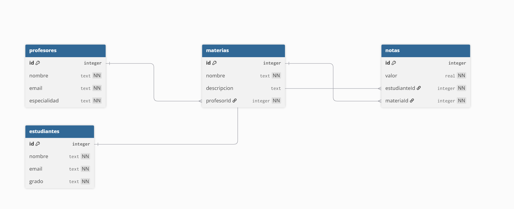

### TALLER BASE DE DATOS Y NODE JS 3229209
### ANDRES FELIPE ALVALREZ RESTREPO
### SEBASTIAN MONSALVE RAMOS

## URL DE LA API REST EN PRODUCCION https://taller-nodejs.onrender.com/

# TODOS LOS ENDPOINTS REQUIEREN EL HEADER
API_PASSWORD = hola1234

### ENDPOINTS

# GET 
https://taller-nodejs.onrender.com/estudiantes -LISTADO DE TODOS (SOPORTA FILTRO POR QUERY)
# GET ID
https://taller-nodejs.onrender.com/estudiantes/1 -BUSCAR POR ID
# POST
https://taller-nodejs.onrender.com/estudiantes -CREAR UNO NUEVO
# PUT 
https://taller-nodejs.onrender.com/estudiantes/1 -ACTUALIZAR 
# DELETE 
https://taller-nodejs.onrender.com/estudiantes/1 -ELIMINAR 

### Diccionario de Datos

#### Tabla `estudiantes`
| Campo | Tipo | PK | FK | Restricción | Descripción |
|-------|------|----|----|-------------|-------------|
| id | INTEGER | SI | NO | AUTOINCREMENT | Identificador único |
| nombre | TEXT | NO | NO | NOT NULL | Nombre del estudiante |
| email | TEXT | NO | NO | NOT NULL, UNIQUE | Correo electrónico |
| grado | TEXT | NO | NO | NOT NULL | Grado escolar |

#### Tabla `profesores`
| Campo | Tipo | PK | FK | Restricción | Descripción |
|-------|------|----|----|-------------|-------------|
| id | INTEGER | SI | NO | AUTOINCREMENT | Identificador único |
| nombre | TEXT | NO | NO | NOT NULL | Nombre del profesor |
| email | TEXT | NO | NO | NOT NULL, UNIQUE | Correo electrónico |
| especialidad | TEXT | NO | NO | NOT NULL | Área de especialidad |

#### Tabla `materias`
| Campo | Tipo | PK | FK | Restricción | Descripción |
|-------|------|----|----|-------------|-------------|
| id | INTEGER | SI | NO | AUTOINCREMENT | Identificador único |
| nombre | TEXT | NO | NO | NOT NULL | Nombre de la materia |
| descripcion | TEXT | NO | NO | - | Descripción opcional |
| profesorId | INTEGER | NO | SI | FK -> profesores.id | Profesor que la dicta |

#### Tabla `notas`
| Campo | Tipo | PK | FK | Restricción | Descripción |
|-------|------|----|----|-------------|-------------|
| id | INTEGER | SI | NO | AUTOINCREMENT |Identificador único |
| valor | REAL | NO | NO | NOT NULL      | Valor de la nota |
| estudianteId | INTEGER | NO | SI | FK -> estudiantes.id | Estudiante evaluado |
| materiaId | INTEGER | NO | SI | FK -> materias.id | Materia evaluada |

ENLACE AL DIAGRAMA ENTIDAD RELACION

